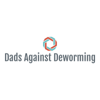
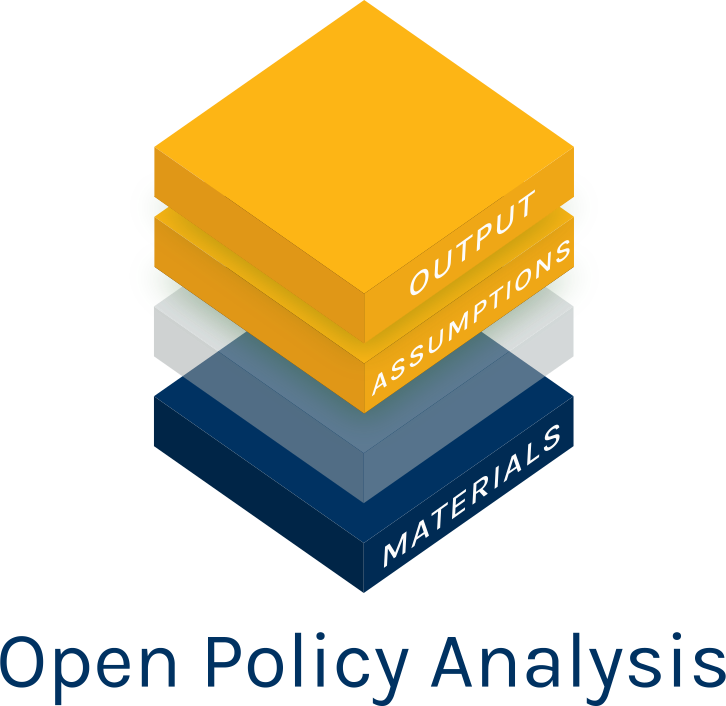
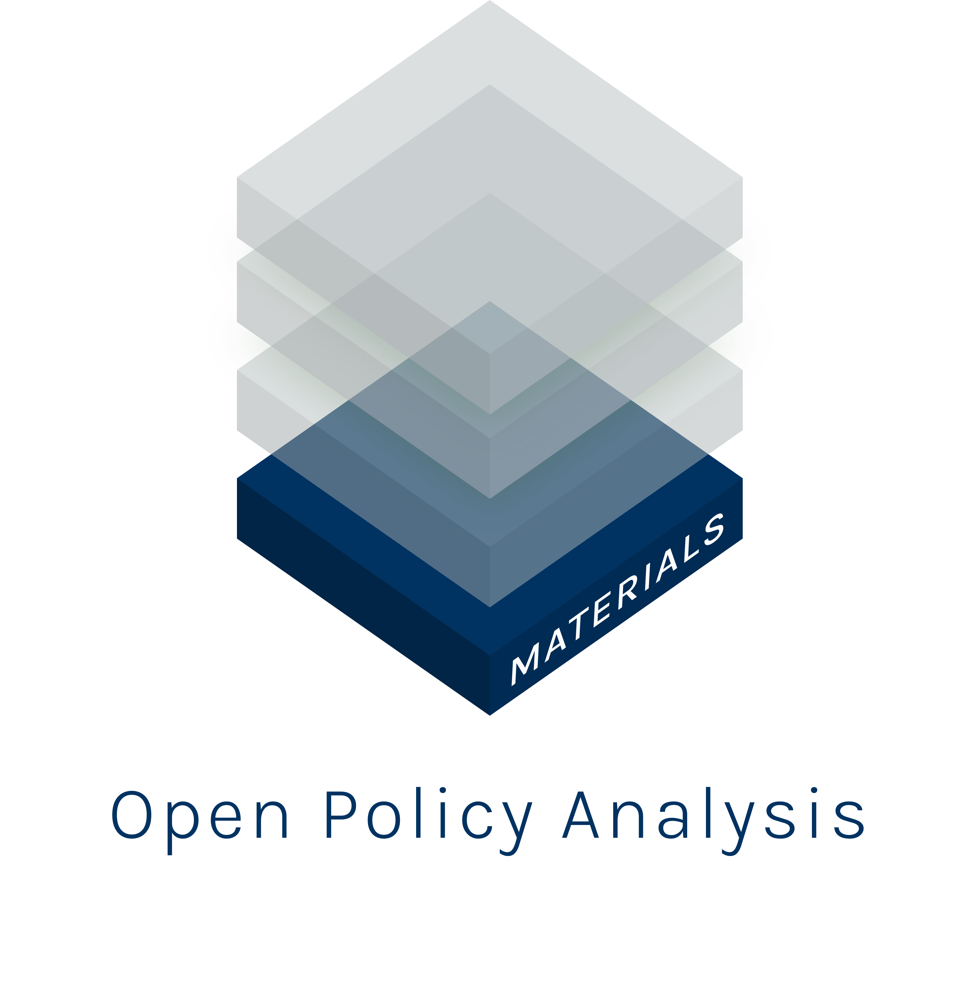

# Policy Analysis  on the Cost Effectiveness of Mass Deworming Interventions (Opposition Analysts Without Open Analysis Component)

## **This is a *fictitous* policy analsysis meant to demonstrate the value of the OPA framework**

 

Open in RStudio:

This repository and its accompanying dynamic document and Shiny app are
two key components of a Dads Against Deworming Analysis (DAD) on the costs and
benefits of mass deworming interventions in various settings. Together,
these materials create a transparent and reproducible analysis to
facilitate collaboration and discussion about deworming policy.

1 - [An interactive plot](https://keanulim123.shinyapps.io/pa-deworming-no-shiny-app/),
which summarizes the interactions between all key parameters for a given
set of assumptions. Materials can be found in:
[`code/shiny_app`](https://github.com/opposition-policy-analysis/pa-deworming-no/tree/master/code/shiny_app).

2 - This Github repository, which stores all data, code, and materials
necessary to replicate the analysis in full with minimal effort.
